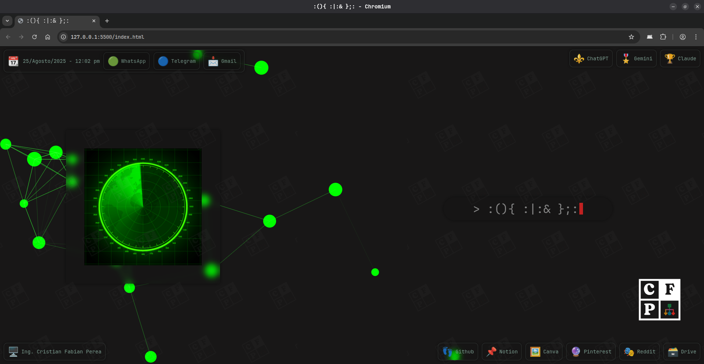

# PÁGINA DE INICIO (STARTPAGE)

## Página (Web) :fleur_de_lis:
- [Visualizar](https://cristianperea88.github.io)

```
/*       _\|/_
         (o o)
 +----oOO-{_}-OOo--------------------------+
 | Página de Inicio para Firefox o Chrome. |
 |   (Startpage for Firefox or Chrome.)    |
 +----------------------------------------*/

```

## Pantallazo (Screenshot) :camera_flash:
 

***

> [!IMPORTANT] :warning:
> El gif [arch](arch.gif) usado no es de mi propiedad, creditos a su respectivo autor.
> > *The gif [arch](arch.gif) is not of my property, credit to your respective author.*

## Créditos (Credits) :recycle:
1. [CaffeineOnIce](https://github.com/CaffeineOnIce/startpage)
2. [NajmosSalahin](https://github.com/NajmosSalahin/startpage)
3. [kencx](https://github.com/kencx/startpage)

***

## Licencia (License) :balance_scale:
- [MIT](LICENSE)
